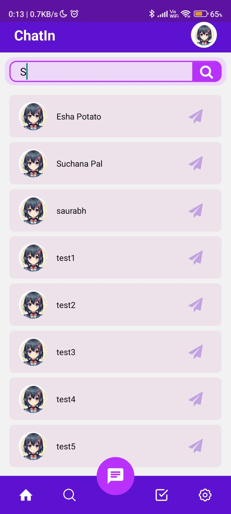

# ChatIn

ChatIn is a social media app that allows users to interact with each other through instant messaging. It is built using React Native Expo and utilizes socket.io for real-time communication.

## Features

- Instant messaging: Users can send and receive messages in real-time.
- Stories: Users can share and view stories from their friends.
- Icebreakers: Engage in icebreaker activities to start conversations with other users.
- Feeds: Stay updated with the latest posts and updates from your friends.

## Technologies Used

- React Native Expo: A framework for building native apps using React.
- Socket.io: A library for real-time, bidirectional and event-based communication.
- [Add any other technologies or libraries used in your project]

## Installation

1. Clone the repository: `git clone https://github.com/your-username/ChatIn.git`
2. Install dependencies: `npm install`
3. Start the development server: `npm start`

## Usage

1. Launch the app on your device or emulator.
2. Create an account or log in if you already have one.
3. Start messaging and interacting with other users.

## Contributing

Contributions are welcome! If you have any ideas, suggestions, or bug reports, please open an issue or submit a pull request.

## Screenshots

| Screenshot 1 | Screenshot 2 |
|--------------|--------------|
|  |  |

| Screenshot 3 | Screenshot 4 |
|--------------|--------------|
|  |  |

## Technologies Used

- React Native Expo: A framework for building native apps using React.
- Socket.io: A library for real-time, bidirectional and event-based communication.

## Contact

For any inquiries or support, please contact srai86825@gmail.com.

